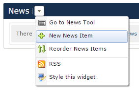
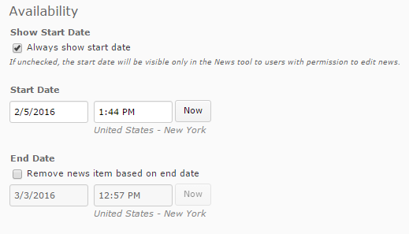

**Create a News Item**

Go to the "Course Home" tab
1. Click the option triangle next to "News"
2. Click the "New News Item" option
3. Use [HTML editor] to type the details of your news alert: Headline and Content
4. Options: 
	* Set the date range you'd like the news item to be available to your students
	* [Add a File]
	* [Release Conditions]
5. "Publish" your news item

TODO links
[HTML Editor]: ../../htmleditor "D2L Editor" 
[Add a File]: ../../addfile "Adding a File"
[Release Conditions]: ../../releaseconditions "Release Conditions"
