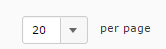
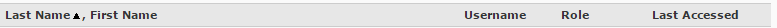
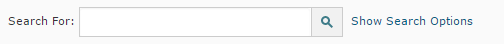
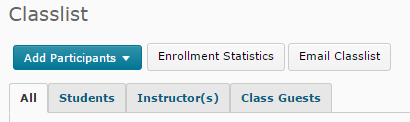

> Find the classlist tool under the "Communication" tab

You can view all the participants enrolled in your course in the classlist tool.

* Set how many participants appear on each page of the classlist.  **Be careful** if you have more than 20 students then there might be more on the next page and if you email from this screen you are only emailing the students you can currently see. 
* Sort students by first or last name, user-name, and by the date they were last logged in to the course by clicking the list column headers to sort by that criterion 
* Find a student quickly by searching for their name or user-name in the search box. 
* View *enrollment statistics* to see the course participant count or to see those who have left the course. 
* [Email] your students from the classlist
* View your ClassList by [Groups] enrollment

TODO links
[Email]: ../email "Email Tool" 
[Groups]: ../ "Groups Tool"
[3]: http:// "Release Conditions"
