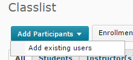
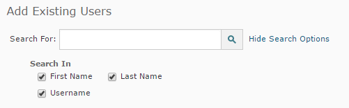
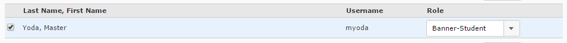
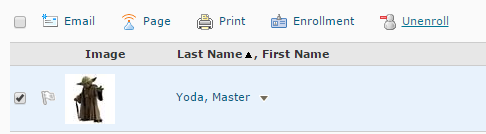

> Find the classlist tool under the "Communication" tab

As the instructor you can add and remove students from your D2L ClassList.

### Enroll a User
1. From the ClassList click the *Add Participant* button and then *Add Existing User* 
2. Using the *Add Existing Users* search box we are going to search for the name or username of the person to add to our course (the username is the most efficient) 
3. Once you've found the user you want to add - check the box to the left of their name and set their *role* in the course.  **Be careful** to ensure that you add a student with the role of student and not as an instructor in your course. With these same directions if you want to add another instructor to edit content in your course.

### Unenroll a User
1. From the ClassList click the check boxes next to the course participants that you want to remove or unenroll.
2. After confirming that you want to unenroll the user, they will be removed from your classlist.