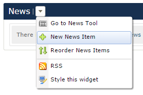
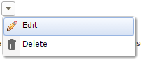
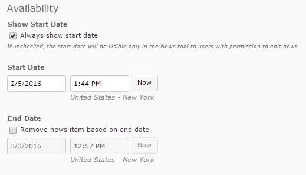

**Edit a News Item**

Go to the "Course Home" tab
1. Click the option triangle next to "News"
2. Click the "Go to News Tool" option
3. Click the option triangle next to the news item that needs editing
4. Use [HTML editor] to modify the details of your news alert
5. Options: 
	* Set the date range you'd like the news item available to your students
	* [Add a File]
	* [Release Conditions]
6. 5. Click "Update" to publish changed news item

TODO links
[HTML Editor]: ../htmleditor "HTML Editor" 
[Add a File]: ../addfile "Adding a File"
[Release Conditions]: ../releaseconditions "Release Conditions"
