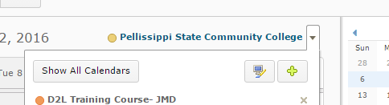
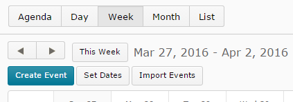

> Find the calendar tool by clicking the date at the top of any screen, under the "Course Tools" tab, or "My Home" screen when you first log in.

If you enter the calendar while inside a course you will start by only seeing events from that course and calendar.  If you enter the calendar from the home screen then you will see all events from all calendars until you select one from the calendar selector dropdown menu. 

There are five calendar views to choose from: Agenda, Week, Month, and List.  Each view shows less or more details and range. Changing between these views only affects your experience and doesn't change what the course participants see when looking at your calendar. 

​
TODO links
[Email]: ../email "Email Tool" 
[Groups]: ../ "Groups Tool"
[3]: http:// "Release Conditions"